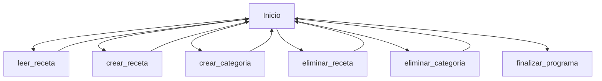

## Proyecto del Día 6 

Llegó el momento de poner todo lo que hemos aprendido en un proyecto del mundo real. Y el 
de hoy sí que nos va a tomar tiempo, porque a pesar de ser relativamente simple, implica mucho 
código, muchas funciones y es imprescindible llevar una especie de orden mental de lo que 
necesitas hacer. Hoy vas a crear un administrador de recetas. Básicamente esto es un programa 
a través del cual un usuario puede leer, crear y eliminar recetas que se encuentren en una base 
de datos. 
Entonces, antes de comenzar, es necesario que crees en tu ordenador un directorio en la carpeta 
base de tu ordenador, con una carpeta llamada Recetas, que contiene cuatro carpetas y cada 
una de ellas contiene dos archivos de texto. Dentro de los archivos puedes escribir lo que 
quieras, puede ser la receta en sí misma o no, pero eso no es importante para este ejercicio. Lo 
importante es que escribas algo para poder leerlas cuando haga falta o, si prefieres, también 
puedes directamente descargar y descomprimir el archivo adjunto a esta elección y ubicarlo en 
tu directorio raíz si no tienes ganas de crearlo tú mismo. 
Aquí viene la consigna: tu código le va a dar primero la bienvenida al usuario, le va a informar 
la ruta de acceso al directorio donde se encuentra nuestra carpeta de recetas, le va a informar 
cuántas recetas hay en total dentro de esa carpeta, y luego le va a pedir que elija una de 
estas opciones que tenemos aquí: 

    1. La opción 1 le va a preguntar qué categoría elige (carnes, ensaladas, etc.), y una vez que 
    el usuario elija una, le va a preguntar qué receta quiere leer, y mostrar su contenido. 
    2. En la opción 2 también se le va a hacer elegir una categoría, pero luego le va a pedir que 
    escriba el nombre y el contenido de la nueva receta que quiere crear, y el programa va 
    a crear ese archivo en el lugar correcto. 
    3. La opción 3 le va a preguntar el nombre de la categoría que quiere crear y va a generar 
    una carpeta nueva con ese nombre. 
    4. La opción 4, hará todo lo mismo que la opción uno, pero en vez de leer la receta, la va 
    a eliminar
    5. La opción 5, le va a preguntar qué categoría quiere eliminar
    6. Finalmente, la opción 6 simplemente va a finalizar la ejecución del código. 

Este programa tiene algunas cuestiones importantes a considerar:

    - Cada vez que el usuario realice exitosamente cualquiera de sus opciones, el programa le 
    va a pedir que presione alguna letra para poder volver al inicio, por lo que el código se 
    va a repetir una y otra vez, hasta que el usuario elija la opción 6. Esto implica que todo 
    el menú debe estar dentro de un loop while que se repita una y otra vez hasta que no se 
    cumpla la condición de que la elección del usuario sea 6 
    - Sería genial que cada vez que el usuario vuelva al menú inicial, la consola limpie la 
    pantalla para que no se acumulen las ejecuciones anteriores. Recuerda que cuentas con 
    system para poder reiniciar la pantalla y comenzar a mostrar todo desde cero. 
    - Si bien te he enseñado muchos métodos para administrar archivos, para este ejercicio 
    vas a necesitar algunos que aún no has visto, pero que están incluidos en los objetos con 
    los que hemos estado trabajando, por lo que en ocasiones deberás buscar entre los 
    métodos que trae Path, por ejemplo, leer la documentación y aprender a implementarlo. 
    Yo sé que sería mucho más fácil que yo te enseñe todo acerca de cada uno de los 
    métodos, pero recuerda que también es importante que a medida que avanzamos vayas 
    aprendiendo a gestionar tu propio aprendizaje. Es parte de la vida real y cotidiana del 
    programador en el mundo en que vivimos. 
    - Utiliza muchas funciones, todas las que creas necesario. Las funciones ayudan a 
    compartir, mentalizar el código y hacerlo mucho más dinámico, ordenado, repetible y 
    más fácil de mantener. 
    - Recuerda comenzar con un diagrama de flujos o un gráfico hecho a mano que te permita 
    visualizar con más facilidad el árbol de decisiones que necesitas ejecutar en tu código. 
    Sin eso te vas a enredar más rápido de lo que crees y se te va a complicar bastante. 
    - Y, por último, no te frustres si no logras hacerlo o completarlo. Si logras hacer una parte, 
    un par de funciones, algunas cosas sí y otras no, está muy bien. Siempre estamos 
    aprendiendo y parte de aprender es no saber. 
    Mis desafíos siempre te van a estar ubicando en el borde de tus capacidades, sacándote del 
    lugar de confort para que tu cerebro tenga que desconcertarse y descubrir cómo hacer algo 
    nuevo. Tu avanza hasta donde puedas

## Pautas

- Envolver código en loop while
- Usar system('cls') o ('clear')
- Buscar nuevos metodos
- Generar varias funciones

- Inicio 
  - Bienvenida
  - Indicar ruta de recetas
  - Nº de recetas totales
  - Pantalla con las opciones
- Leer receta
  - Elegir categoría
  - Mostrar recetas
  - Elegir receta
  - Leer receta
- Crear receta
  - Elegir categoría
  - Crear Nombre
  - Crear contenido
- Crear categoría
  - Nombre de categoría
  - Crear categoría
- Eliminar receta
  - Elegir categoría
  - Mostrar recetas
  - Elegir receta
  - Eliminar receta
- Eliminar Categoría
  - Elegir categoría
  - Eliminar categoría
- Finalizar programa
  - Fin codigo

## Gráfico de flujo

